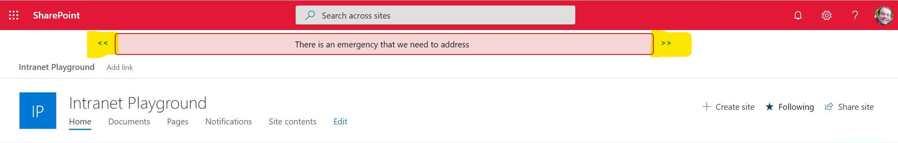

# SharePoint Site Notification Extension

This is a SharePoint Framework Extension that displays a notification in the top placeholder extension location. The notification data is sourced from a list local to the site. This is solution that is derived from an [extension](https://github.com/SharePoint/sp-starter-kit/tree/master/solution/src/extensions/alertNotitication) delivered as part of the [SharePoint Framework Starter Kit](https://github.com/SharePoint/sp-starter-kit). This solution pulls much of the approach and some of the code from that extension so total credit to the contributors to that solution!


> __FYI__ This extension was bootstrapped using the SharePoint Framework Yoeman generator *targeting SharePoint Online*

Beyond the basics of displaying the notification, this extension provides the ability to scroll through all notifications found in the list.



## SharePoint Site Setup
This solution does rely on the existence of a list in the local SharePoint site. The [SharePoint Starter Kit version of this](https://github.com/SharePoint/sp-starter-kit/tree/master/solution/src/extensions/alertNotitication) has a more elegant approach that looks for the list in the associated hub site. This one takes a more basic approach and looks in the local site. 

The list should be named *Notifications* and have the following structure in addition to the default list fields:
|Field name|Type|Option Values|Required?|
|----------|----|-------------|---------|
|NotificationMessage|Single line of text|*N/A*|Yes|
|NotificationLevel|Choice|"Emergency" "Warning" "Notification"|Yes|
|StartDate|Date and Time|*N/A*|Yes|
|EndDateTime|Date and Time|*N/A*|Yes|
|MoreInformationLink|Single line of text|*N/A*|No|

You can populate this list manually or do as I describe in [this blog post](https://medium.com/pjsummersjr) and build a [PowerApp](https://powerapps.microsoft.com) to do it.

## Building the code

Building the solution requires both some standard JavaScript build steps as well as some steps specific to deploying SPFX extensions

### Clone the repo & install using npm

```bash
git clone https://github.com/pjsummersjr/spfx-alert-extension.git
npm i
```

### Configure and run code locally for debugging
SPFX site extensions can't leverage the local Workbench like an SPFX web part but you can still serve up your extension code locally and connect to it from an existing SharePoint Online site. The detailed instructions for setting this up can be found [here](https://docs.microsoft.com/en-us/sharepoint/dev/spfx/extensions/get-started/build-a-hello-world-extension#debug-your-application-customizer).

Once you're running `gulp serve`, it delivers the code from your localhost but it will also open your debug SharePoint Online site.  

### Build and Deploy
Once you're ready to actually deploy the code and deliver it from a CDN, one path is to deploy the code to Office 365 CDN. Instructions for setting that up in your SharePoint Online environment can be found [here](https://docs.microsoft.com/en-us/sharepoint/dev/spfx/extensions/get-started/hosting-extension-from-office365-cdn).

Once that's done, build it up and package it up:
```bash
gulp build --ship
gulp package-solution --ship
```
This will create the .sppkg package file under [Project Root]/sharepoint/solution/[package name].sppkg

You can define the name of the .sppkg file in [Project Root]/config/package-solution.json under paths/zippedPackage.

As [describe here](https://docs.microsoft.com/en-us/sharepoint/dev/spfx/extensions/get-started/hosting-extension-from-office365-cdn#update-your-solution-project-for-the-cdn-urls), this package file needs to be deployed to your tenant app catalog and you have to approve of the code being served from SharePoint Online.

